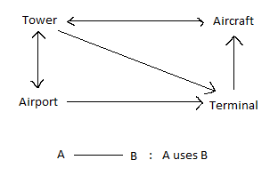

# Se familiariser avec l'existant

## A- Exécution

Compilez et lancez le programme.

Allez dans le fichier `tower_sim.cpp` et recherchez la fonction responsable de gérer les inputs du programme.\
Sur quelle touche faut-il appuyer pour ajouter un avion ?

- C

Comment faire pour quitter le programme ?

- X ou Q

A quoi sert la touche 'F' ?

- À mettre en plein écran

Ajoutez un avion à la simulation et attendez. Quel est le comportement de l'avion ?

- L'avion se pose et va dans un terminal, puis re-décolle une fois qu'il a fini d'être entretenu. Il tourne autour de
  l'aéroport et au bout d'un certain temps, il va se reposer puis re-décoller, re-tourner autour de l'aéroport, puis se
  re-repose etc...

Quelles informations s'affichent dans la console ?

- La boucle consiste en ces 4 étapes :
    - AF8977 is now landing...
    - now servicing AF8977...
    - done servicing AF8977
    - AF8977 lift off

Ajoutez maintenant quatre avions d'un coup dans la simulation. Que fait chacun des avions ?

- Les 3 premiers se déposent ("X is now landing..."), alors que le 4ème continue de voler autour de l'aéroport car il n'
  y a plus de terminaux libres.\
  Les 3 avions qui se sont posés se mettent ensuite en service ("now servicing X" et "done servicing X"), et
  décollent ("X lift off").\
  Le 4ème avion peut ainsi se poser et se mettre en service à son tour.\
  L'aéroport n'a que 3 places pour que les avions se déposent, donc si toutes les places sont déjà prises, les avions
  qui sont dans les airs doivent attendre pour se déposer et effectuent donc un tour de l'aéroport dans les airs.

## B- Analyse du code

Listez les classes du programme à la racine du dossier src/. Pour chacune d'entre elle, expliquez ce qu'elle représente
et son rôle dans le programme.

- Aircraft : représente un avion et ses différentes fonctionnalités qui sont les suivantes
    - Permet de faire tourner correctement l'avion vers son prochain waypoint lorsqu'il arrive à un waypoint (cf.
      turn_to_waypoint() & turn())
    - D'affiche un avion dans la fenêtre (cf. display() && get_speed_octant())
    - Signale la tour (class Tower) lorsqu'un Aircraft arrive dans un terminal (cf. arrive_at_terminal())
    - Va s'occuper du décollage et atterrissage d'un avion selon les waypoints de l'avion ("XX is now landing" et "XX
      lift off", cf. operate_landing_gear())
    - De faire bouger l'avion selon les waypoints atteints (cf. move())

- AircraftType : représente les 3 types d'avions qu'on peut créer
    - Personnalise chaque type d'avions : sa vitesse (sol, air, accélération) et sa texture

- Airport : représente un aéroport
    - Permet de réserver un terminal pour un avion s'il y en a un de disponible et de renvoyer une séquence de waypoints
      à effectuer ainsi que le nombre de terminaux actuellement disponible (cf. reserve_terminal())
    - De faire décoller un avion (cf. start_path())
    - D'afficher l'aéroport sur la fenêtre (cf. display())

- AirportType : représente les différentes caractéristiques d'un aéroport (champ AirportType& type dans Airport)
    - Créer les terminaux à partir d'une liste de terminaux (std::initializer_list<Point3D>, cf. create_terminals())
    - Le chemin à emprunter lorsqu'un avion part d'un terminal jusqu'à ses différents waypoints dans les airs (cf.
      terminal_to_air())
    - Et vice-versa, le chemin à emprunter pour un avion des airs jusqu'à un terminal (cf. air_to_terminal())
    - La variable global "one_lane_airport" représente l'AirportType utilisé pour créer l'Airport de notre programme

- Point2D/Point3D (geometry.hpp) : représente un point et ses coordonnées en 2D/3D

- Runway : représente les positions des pistes d'atterrissage (son début et sa fin)

- Terminal : représente un terminal
    - S'occupe d'un aircraft lorsqu'il atterrit dans le terminal\
      (cf. question suivante pour plus de détails sur les fonctions)

- Tower : représente une tour de contrôle (notamment présent dans l'objet Airport)
    - Permet de donner des instructions à un aircraft (cf. get_circle() pour le faire tourner dans les airs si aucuns
      terminaux n'est disponible, ou find_craft_and_terminal() pour récupérer un aircraft associé à un terminal)\
      (cf. question suivante pour plus de détails sur les fonctions)

- TowerSimulation : Créer une simulation avec un aéroport, une tour de contrôle, des terminaux et des avions
    - Permet de créer tout type d'aircraft tout en l'ajoutant à la liste d'avions à afficher (display_queue) et une
      liste d'avions à bouger (move_queue) (cf. create_aircraft() et create_random_aircraft())
    - Permet d'associer une touche du clavier à des fonctionnalités de la simulation (créer des aircrafts, zoomer,
      etc...)
    - Initialise un airport et la boucle de la simulation (cf. launch())

- Waypoint : représente un waypoint (un "point de contrôle")
    - Permet de déterminer une position en 3D dans la fenêtre, tout en indiquant si celle-ci se situe dans les airs ou
      sur le sol
    - Introduit également WaypointQueue qui est un conteneur de Waypoints

Pour les classes `Tower`, `Aircaft`, `Airport` et `Terminal`, listez leurs fonctions-membre publiques et expliquez
précisément à quoi elles servent.

- Tower :
    - WaypointQueue get_instructions(Aircraft& aircraft)
        - Retourne les instructions effectuer pour un aircraft selon son état (dans les airs ou dans un terminal) et de
          la disponibilité actuelle des terminaux
            - Par exemple si un aircraft n'est pas dans un terminal et qu'il est proche de notre airport, on essaye soit
              de le faire atterrir dans un terminal, soit on lui refait faire une ronde si tous les terminaux sont
              occupés
            - Ou bien s'il est dans un terminal, on regarde s'il a terminé son service pour le refaire décoller
    - void arrived_at_terminal(const Aircraft& aircraft)
        - Permet de débuter l'entretien d'un aircraft lorsque la tour a été alerté qu'un aircraft est arrivé à un
          terminal

- Aircraft :
    - const std::string& get_flight_num() const
        - Retourne le flight_number d'un aircraft
    - float distance_to(const Point3D& p) const
        - Renvoie la position entre l'aircraft et la position en 3D donné en argument
    - void display() const override
        - Affiche l'aircraft sur la fenêtre
    - void move() override
        - Bouge un aircraft selon ses waypoints courants s'il en a (auquel cas on lance la fonction get_instructions()
          de notre tower, cf. fonctions de Tower) tout en vérifiant que l'aircraft ne va pas se crasher

- Airport :
    - Tower& get_tower()
        - Retourne la tower d'un airport
    - void _display_() const override
        - Affiche l'airport sur la fenêtre
    - void move() override
        - Lance la fonction move() de tous les terminaux de l'airport (cf. fonctions de Terminal)

- Terminal :
    - bool in_use() const
        - Renvoie un boolean selon si le terminal s'occupe ou va s'occuper d'un aircraft
    - bool is_servicing() const
        - Renvoie un boolean selon si le terminal est en train d'entretenir un aircraft
    - void assign_craft(const Aircraft& aircraft)
        - Permet d'assigner un aircraft à son champ current_aircraft (donc de s'occuper d'un aircraft, cf. in_use())
    - void start_service(const Aircraft& aircraft)
        - Permet de commencer l'entretien d'un aircraft (message d'affichage "now servicing XXX...") (cf.
          is_servicing())
    - void finish_service()
        - Check si le terminal a fini d'entretenir un aircraft auquel cas on enlève l'aircraft actuel du champ
          current_aircraft en mettant ce champs à nullptr (message d'affichage "done servicing XXX")
    - void move() override
        - Permet de faire bouger l'aircraft actuellement entretenu par le terminal en incrémentant son
          service_progress (qui doit être supérieur à SERVICE_CYCLES pour que son entretien soit terminé)

Réalisez ensuite un schéma présentant comment ces différentes classes interagissent ensemble.

Quelles classes et fonctions sont impliquées dans la génération du chemin d'un avion ?

- C'est essentiellement la fonction `Tower::get_instructions(Aircraft& aircraft)` qui va gérer et générer le chemin d'un
  aircraft. En fonction de l'état de notre aéroport, la fonction va :\
    - Si un terminal est disponible et que l'aircraft n'a pas de chemin (son container `waypoints` est vide)
      , `Airport::reserve_terminal(Aircraft& aircraft)` va retourner le chemin contenu dans la
      fonction `AirportType::air_to_terminal(const Point3D& offset, const size_t runway_num, const size_t terminal_num)`
      pour que l'aircraft se rende à un terminal.
    - Si aucun terminal n'est disponible et que l'aircraft n'a pas/plus de chemin, la fonction `Tower::get_circle()` va
      lui générer un chemin à effectuer dans les airs (4 waypoints qui se situent au sud - est - nord - ouest).
    - Enfin, si un aircraft a fini d'être entretenu dans un terminal, la
      fonction `Airport::start_path(const size_t terminal_number)` va lui renvoyer un nouveau chemin à l'aide de la
      fonction `AirportType::terminal_to_air(const Point3D& offset, const size_t runway_num, const size_t terminal_num)`
      .
- On a donc les classes `Airport`, `Tower` et `AirportType` qui vont être impliquées dans la génération du chemin d'un
  avion.

Quel conteneur de la librairie standard a été choisi pour représenter le chemin ?

- std::deque (WaypointQueue = std::deque<Waypoint>)

Expliquez les intérêts de ce choix.

- Ce conteneur nous permet d'ajouter et de supprimer des éléments au début comme à la fin de celui-ci en temps constant
  O(1), ce qui peut être pratique si on veut rajouter un nouveau waypoint au début ou à la fin du container courant.

## C- Bidouillons !

1) Déterminez à quel endroit du code sont définies les vitesses maximales et accélération de chaque avion. Le Concorde
   est censé pouvoir voler plus vite que les autres avions. Modifiez le programme pour tenir compte de cela.

La vitesse de nos 3 types d'avions se situent dans le fichier aircraft_types.hpp., dans la
fonction `init_aircraft_types()`.\
Si on veut modifier la vitesse du concorde, on modifie les variables qui y sont (le concorde correspond
à `aircraft_types[2]` comme nous l'indique le nom de l'image utilisée pour afficher l'avion), la 1ère correspondant à sa
vitesse au sol, la seconde à sa vitesse dans les airs et la 3ème son accélération.\
J'ai multiplié par 2 toutes les vitesses qui étaient initialement.

2) Identifiez quelle variable contrôle le framerate de la simulation. Ajoutez deux nouveaux inputs au programme
   permettant d'augmenter ou de diminuer cette valeur. Essayez maintenant de mettre en pause le programme en manipulant
   ce framerate. Que se passe-t-il ?\
   Ajoutez une nouvelle fonctionnalité au programme pour mettre le programme en pause, et qui ne passe pas par le
   framerate.

C'est la variable `ticks_per_sec` dans le fichier `opengl_interface.hpp` qui contrôle le framerate de la simulation (
avec sa valeur par défaut `DEFAULT_TICKS_PER_SEC` dans `config.hpp`).\
Pour augmenter/diminuer le framerate, on ajoute les fonctions `increase_framerate()`/`decrease_framerate()`
dans `opengl_interface.cpp` et dans `TowerSimulation::create_keystrokes()`, on associe 2 nouveaux inputs 'a' et 'z' pour
utiliser ces fonctions.\
Si on essaye de mettre pause en mettant le framerate à 0, le programme crash : la fonction `timer(const int step)` dans
`opengl_interface.cpp` effectue une division par 0 (glutTimerFunc(1000u / ticks_per_sec, timer, step + 1)).\
Pour introduire la pause, on ajoute le boolean `is_pause` dans `opengl_interface.hpp` qui passe de false à true chaque
fois qu'on va appuyer sur la touche 'p'. Et dans la fonction `timer(const int step)`, on effectue `move()` sur les
éléments de `move_queue` seulement si `is_pause` est false.

3) Identifiez quelle variable contrôle le temps de débarquement des avions et doublez-le.

Le temps de débarquement des avions correspond au temps que passent les avions dans chaque terminal. Un avion finit son
débarquement dans un terminal tant que `service_progress < SERVICE_CYCLES` et la variable `service_progress` est
incrémentée à chaque fois que `Terminal::move()` est appelée.\
Ainsi, pour doubler le temps de débarquement, on double la valeur de `SERVICE_CYCLES` dans `config.hpp`.

4) Lorsqu'un avion a décollé, il réattérit peu de temps après. Faites en sorte qu'à la place, il soit retiré du
   programme.\
   Indices :\
   A quel endroit pouvez-vous savoir que l'avion doit être supprimé ?\
    - Une fois que l'aircraft a fini d'être entretenu par un terminal. On vérifie cet état dans la
      fonction `Tower::get_instructions(Aircraft& aircraft)`.

   Pourquoi n'est-il pas sûr de procéder au retrait de l'avion dans cette fonction ?
    - On utiliser cette fonction afin de retourner un `WaypointQueue` à un `Aircraft` dans sa
      fonction `Aircraft::move()` afin d'actualiser son `waypoints` pour que celui-ci sache où il doit aller.\
      Or si on supprime l'aircraft dans la fonction `Tower::get_instructions(Aircraft& aircraft)`, alors on va supprimer
      l'aircraft alors qu'on était en plein appel de sa fonction `Aircraft::move()`.

   A quel endroit de la callstack pourriez-vous le faire à la place ?\
    - Lorsqu'on appelle la fonction `move()` sur chacun des aircrafts dans la fonction `timer(const int step)`
      de `opengl_interface.cpp`, on aimerait savoir si un aircraft vient de partir d'un terminal et ainsi le supprimer
      si c'est le cas.

   Que devez-vous modifier pour transmettre l'information de la première à la seconde fonction ?
    - On pourrait utiliser un boolean retourner par la fonction `move()` qui renvoie true si l'aircraft vient de partir
      d'un terminal, ce qui signifierait qu'on doit supprimer celui-ci.

Pour supprimer un aircraft, on va donc modifier la fonction `move()` dans `dynamic_object.hpp` : au lieu de retourner
void, on va désormais retourner un bool.\
De ce fait, on modifie les différentes implémentations de cette fonction dans les classes `Aircraft`, `Airport` et
`Terminal`.\
Dans `Airport` et `Terminal`, on renvoie toujours `true` à la fin de la fonction.\
Dans `Aircraft`, on doit faire en sorte de renvoyer `false` dès lors que l'aircraft est passé dans un terminal. Donc si
celui-ci n'est pas encore allé dans un terminal, mais qu'il n'a pas encore de waypoints (donc typiquement au moment où
il est crée), on ne doit pas le supprimer.\
Pour cela, on va faire en sorte que l'instruction `waypoints = control.get_instructions(*this);` renvoie
un `WaypointQueue` vide si l'aircraft est passé par un terminal. Puis à l'instruction suivante, lorsqu'on va vérifie si
l'aircraft n'est pas dans un terminal, on va également vérifier si son `waypoints` est empty, auquel cas cela voudra
dire que le get_instructions() plus haut a renvoyé un `WaypointQueue` vide pour nous avertir que l'aircraft est déjà
passé par un terminal et qu'on peut donc le supprimer.\
Dans `Tower::get_instructions(Aircraft& aircraft)`, on remarque lorsqu'un aircraft est trop loin de l'aéroport (le else
de `aircraft.distance_to(airport.pos) < 5`), on lui renvoie `get_circle()` afin qu'il fasse un tour de l'aéroport. Or,
un aircraft se situe seulement au-delà de cette distance seulement lorsqu'il fait le chemin retourné
par `terminal_to_air(const Point3D& offset, const size_t runway_num, const size_t terminal_num)`, donc lorsqu'un
aircraft quitte un terminal pour retourner dans les airs. On va donc retourner à cet endroit un `WaypointQueue` vide
plutôt que `get_circle()`.

5) Lorsqu'un objet de type `Displayable` est créé, il faut ajouter celui-ci manuellement dans la liste des objets à
   afficher. Il faut également penser à le supprimer de cette liste avant de le détruire. Faites en sorte que l'ajout et
   la suppression de `display_queue` soit "automatiquement gérée" lorsqu'un `Displayable` est créé ou détruit. Pourquoi
   n'est-il pas spécialement pertinent d'en faire de même pour `DynamicObject` ?

Pour faire en sorte d'ajouter un `Displayable` à `display_queue` à sa creation, on ajoute dans son constructeur
l'instruction pour s'ajouter lui-même dans `display_queue`.\
Pour la suppression, dans le destructeur virtuel de `Displayable`, on fait en sorte que le l'objet `Displayable` qui se
fait delete se supprime également de la `display_queue` au même moment.

6) La tour de contrôle a besoin de stocker pour tout `Aircraft` le `Terminal` qui lui est actuellement attribué, afin de
   pouvoir le libérer une fois que l'avion décolle. Cette information est actuellement enregistrée dans
   un `std::vector<std::pair<const Aircraft*, size_t>>` (size_t représentant l'indice du terminal). Cela fait que la
   recherche du terminal associé à un avion est réalisée en temps linéaire, par rapport au nombre total de terminaux.
   Cela n'est pas grave tant que ce nombre est petit, mais pour préparer l'avenir, on aimerait bien remplacer le vector
   par un conteneur qui garantira des opérations efficaces, même s'il y a beaucoup de terminaux.\
   Modifiez le code afin d'utiliser un conteneur STL plus adapté. Normalement, à la fin, la
   fonction `find_craft_and_terminal(const Aicraft&)` ne devrait plus être nécessaire.

Dans `tower.hpp`, au lieu d'utiliser un `std::vector<std::pair<const Aircraft*, size_t>>;`, on va utiliser
une `std::unordered_map<const Aircraft*, size_t>`.\
Puis on change les appels à la fonction `find_craft_and_terminal(const Aicraft&)`
en `reserved_terminals.find(&aircraft)` (et pour ajouter un élément, on utilise `emplace()` plutôt que `emplace_back()`)
.

## D- Théorie

1) Comment a-t-on fait pour que seule la classe `Tower` puisse réserver un terminal de l'aéroport ?

Dans la classe `Airport`, on a déclaré `friend class Tower;`, ce qui signifie que la classe `Tower` peut accéder aux
champs et fonctions privés de la classe `Airport`, plus particulièrement à la fonction
privé `Airport::reserve_terminal(Aircraft& aircraft)` qui permet de réserver un terminal de l'aéroport.

2) En regardant le contenu de la fonction `void Aircraft::turn(Point3D direction)`, pourquoi selon-vous ne sommes-nous
   pas passer par une réference constante ? Pensez-vous qu'il soit possible d'éviter la copie du `Point3D` passé en
   paramètre ?

Pour éviter de pouvoir modifier directement la valeur de la direction passée en paramètre puisque
dans `void Aircraft::turn(Point3D direction)`, on appelle la fonction `Point3D::cap_length(const float max_len)` qui
modifie la valeur du Point3D.\
Etant donné qu'on veut seulement modifier "temporairement" (puisqu'on veut retrouver sa valeur de base par la suite) la
valeur de la direction (qui est soi-disant l'addition de 3 différentes valeurs : target, pos et speed), on est obligé de
copier le paramètre.

## E- Bonus

Le temps qui s'écoule dans la simulation dépend du framerate du programme. La fonction move() n'utilise pas le vrai
temps. Faites en sorte que si. Par conséquent, lorsque vous augmentez le framerate, la simulation s'exécute plus
rapidement, et si vous le diminuez, celle-ci s'exécute plus lentement.

Dans la plupart des jeux ou logiciels que vous utilisez, lorsque le framerate diminue, vous ne le ressentez quasiment
pas (en tout cas, tant que celui-ci ne diminue pas trop). Pour avoir ce type de résultat, les fonctions d'update
prennent généralement en paramètre le temps qui s'est écoulé depuis la dernière frame, et l'utilise pour calculer le
mouvement des entités.

Recherchez sur Internet comment obtenir le temps courant en C++ et arrangez-vous pour calculer le dt (delta time) qui
s'écoule entre deux frames. Lorsque le programme tourne bien, celui-ci devrait être quasiment égale à 1/framerate.
Cependant, si le programme se met à ramer et que la callback de glutTimerFunc est appelée en retard (oui oui, c'est
possible), alors votre dt devrait être supérieur à 1/framerate.

Passez ensuite cette valeur à la fonction `move` des `DynamicObject`, et utilisez-la pour calculer les nouvelles
positions de chaque avion. Vérifiez maintenant en exécutant le programme que, lorsque augmentez le framerate du
programme, vous n'augmentez pas la vitesse de la simulation.

Ajoutez ensuite deux nouveaux inputs permettant d'accélérer ou de ralentir la simulation.
